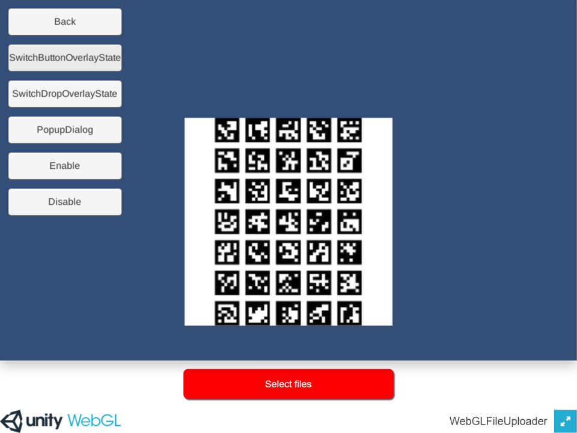
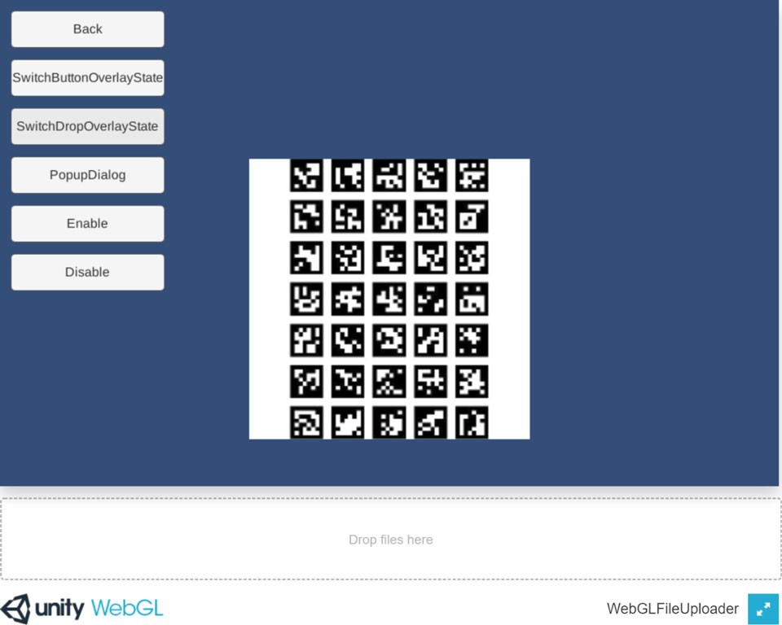
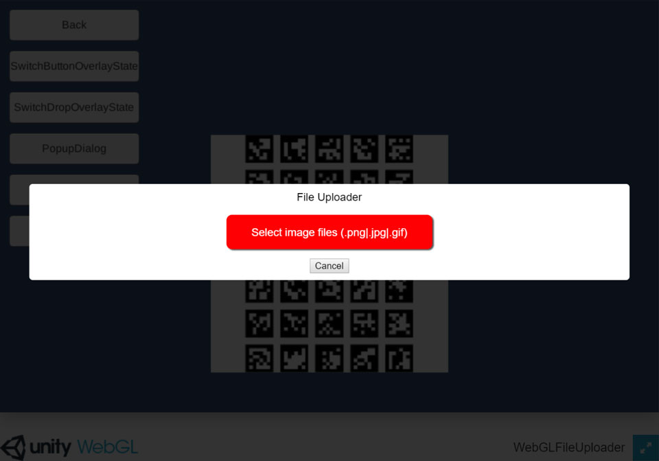
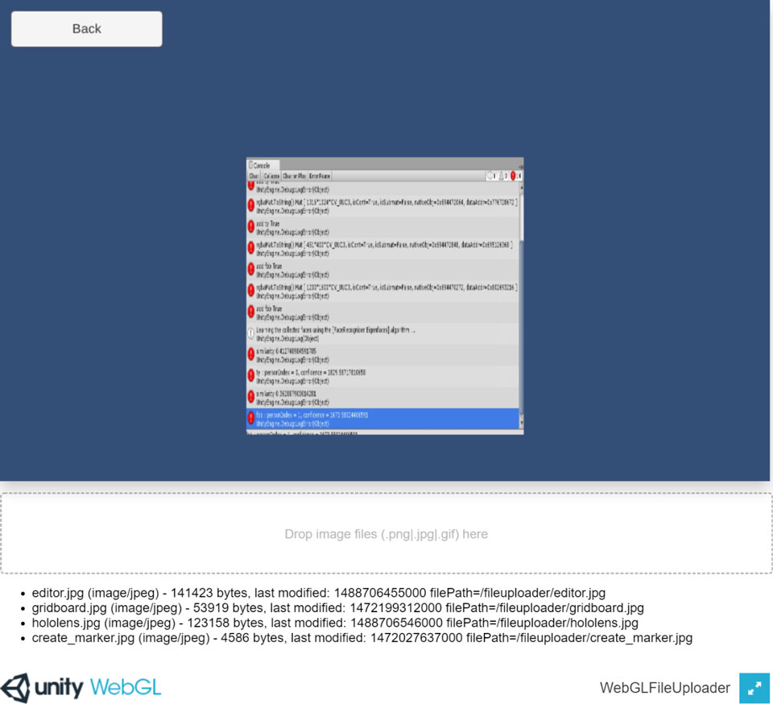

WebGL File Uploader
====================

This asset adds file upload capability to the Unity WebGL platform.

Overview
-----
* WebAssembly build support.
* Multiple file uploads support.
* Allowed file name setting (Regular expression) support.
* Image type encoding support.
* Image shrinking support.
* Popup dialog support.

Demo
-----
* WebGL [https://enoxsoftware.github.io/WebGLFileUploader/webgl_example/index.html](https://enoxsoftware.github.io/WebGLFileUploader/webgl_example/index.html)

Setup Example Project
-----
* Create a new project. (WebGLFileUploaderExample)
* Import the WebGLFileUploader.unitypackage.
* Import the OpenCVForUnity. (not required)
* Add the "Assets/WebGLFileUploader/*.unity" files to the "Scenes In Build" list in the "Build Settings" window.
* Switch to WebGL platform in the "Player Settings" window.
* Select a dedicated template ([FileUploader5.3-5.5] or [FileUploader5.6-2017]) in the Player Settings inspector (menu: Edit > Project Settings > Player).
* Build and Deploy.

ScreenShot
-----
 

 

 

 

